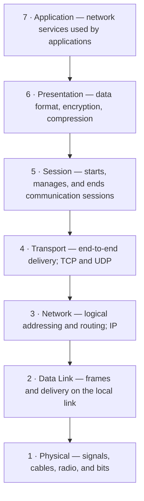
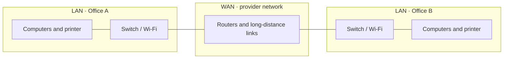

# Networking Basics

This guide introduces the OSI model, local and wide-area networks, the
Internet, IP addressing, and the transport protocols used by everyday
applications.

## OSI Model

The **Open Systems Interconnection (OSI) model** is a conceptual framework
for describing how data moves between networked devices. It divides
communication into **seven layers**. Each layer has a distinct job and
provides services to the layer above it.

Read the layers from **Layer 7 to Layer 1** when describing data sent by an
application. At the sender, each layer adds information (encapsulation); at
the receiver, the layers process and remove it in reverse order
(decapsulation).



| Layer | Name | Main responsibility | Example data unit |
| --- | --- | --- | --- |
| 7 | Application | Network services directly used by applications | Data |
| 6 | Presentation | Data representation, encryption, and compression | Data |
| 5 | Session | Establishing, managing, and ending conversations | Data |
| 4 | Transport | Communication between processes; ports and delivery behavior | Segment (TCP) / datagram (UDP) |
| 3 | Network | IP addressing and routing between networks | Packet |
| 2 | Data Link | Local-link delivery using frames and hardware addresses | Frame |
| 1 | Physical | Sending raw bits as electrical, optical, or radio signals | Bits |

The layer names are commonly memorized from bottom to top as **Physical,
Data Link, Network, Transport, Session, Presentation, Application**.

## LAN and WAN

### LAN

A **Local Area Network (LAN)** connects devices in a limited area, usually
under the control of one person or organization.

- **Typical usage:** connecting computers, phones, printers, and Wi-Fi
  access points in a home, classroom, office, or building.
- **Typical geographical size:** a room, home, office, building, or campus;
  generally from a few metres to a few kilometres.
- **Examples:** home Wi-Fi and an office Ethernet network.

### WAN

A **Wide Area Network (WAN)** connects networks over large geographical
distances. It often relies on carrier or Internet Service Provider (ISP)
infrastructure.

- **Typical usage:** connecting offices in different cities or countries,
  or connecting a home or business network to a provider network.
- **Typical geographical size:** spans cities, regions, countries, or
  continents.
- **Example:** a company linking its branch-office LANs with leased lines
  or VPN connections.



LAN and WAN are descriptions of network scope, not specific technologies:
Ethernet and Wi-Fi are commonly used in LANs, while WAN connections may use
fibre, cellular links, leased lines, or VPNs.

## The Internet and IP

The **Internet** is a global **network of interconnected networks**. Those
networks communicate using the Internet Protocol (IP) suite. The public
Internet is not one giant LAN: routers forward traffic between many
independently operated networks.

### IP addresses

An **IP address** is a logical address used to identify an interface on an IP
network and to route packets toward it. Two different distinctions are
useful:

1. **IP versions:** IPv4 addresses are 32 bits (for example,
   `192.0.2.10`); IPv6 addresses are 128 bits (for example,
   `2001:db8::10`).
2. **Address reachability:** a **private** address is intended for use
   inside private networks and is not routed across the public Internet;
   a **public** address is globally routable. A router commonly translates
   between private addresses and a public address using Network Address
   Translation (NAT).

Private IPv4 ranges are `10.0.0.0/8`, `172.16.0.0/12`, and
`192.168.0.0/16`. IPv6 also has private-use (unique-local) addresses, so
public/private is not limited to IPv4.

### Localhost

**`localhost`** is the hostname for the current device itself. It resolves
to a loopback address, so traffic sent to it stays on that device rather
than going out onto the LAN or Internet. The usual loopback addresses are:

- IPv4: `127.0.0.1` (within `127.0.0.0/8`)
- IPv6: `::1`

For example, a web server accessed at `http://localhost:8000` is being
contacted on the same machine, on port 8000.

### Subnets

A **subnet** is a logically defined portion of an IP network. A subnet
prefix (often written in **CIDR** notation) indicates which leading address
bits identify the network and which remaining bits identify addresses
within it. Subnets help organize networks and determine whether a
destination is local or must be reached through a router.

For example, `192.168.1.0/24` has 24 network-prefix bits. In IPv4, that
corresponds to the subnet mask `255.255.255.0`; the addresses
`192.168.1.1` and `192.168.1.20` are in that subnet.

### Why IPv6 was created

IPv6 was created primarily because the supply of usable IPv4 addresses was
running short as more devices and networks connected to the Internet. Its
128-bit address space is vastly larger than IPv4's 32-bit space. IPv6 also
supports more scalable address allocation and networking. NAT helped extend
IPv4, but it does not remove the underlying address-space limit.

## TCP and UDP

**Transmission Control Protocol (TCP)** and **User Datagram Protocol
(UDP)** are the two main transport-layer protocols used with IP. They let
multiple application conversations share a device's network connection by
using **port numbers**.

| Property | TCP | UDP |
| --- | --- | --- |
| Connection | Connection-oriented; establishes a connection | Connectionless; sends datagrams without establishing a connection |
| Delivery | Provides ordered, reliable delivery, retransmitting lost data | Does not guarantee delivery, order, or retransmission |
| Overhead | More protocol overhead and connection state | Smaller header and less built-in overhead |
| Common uses | Web traffic, SSH, email, file transfers | DNS queries, voice/video, online games, and other delay-sensitive traffic |

Applications choose the protocol that fits their needs. UDP is not
automatically faster in every situation; it leaves reliability and ordering
to the application when those are needed.

### Ports

A **port** is a number used by the transport layer to identify a particular
application or service on a device. An IP address identifies the network
interface or destination device; the combination of an IP address, a
transport protocol, and a port helps identify the destination service.

Remember these commonly used default ports:

| Service | Protocol | Default port | Purpose |
| --- | --- | ---: | --- |
| SSH | TCP | **22** | Secure remote login and command-line access |
| HTTP | TCP | **80** | Unencrypted web traffic |
| HTTPS | TCP | **443** | Encrypted web traffic using TLS |

These are default ports, not a guarantee that every server uses them. A
service can be configured to listen on another port.

## Checking network connectivity: `ping`

The commonly used tool is **`ping`**. It sends ICMP Echo Request messages
to a destination and reports whether Echo Replies arrive, along with
round-trip time information. For example:

```text
ping 192.168.1.1
```

This can help check whether a device is reachable at the IP layer, but it
does **not** prove that a particular application or port is working. Some
devices and networks block ICMP, so a missing reply does not always mean
the device is offline.
